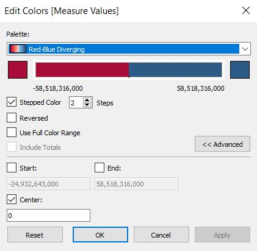
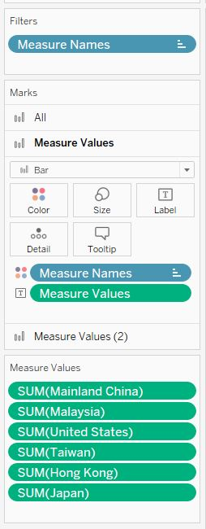

```{r setup, include=FALSE}
knitr::opts_chunk$set(echo = FALSE)
```
## 1)	Current data visualisation 


 
The current data visualisation above had been created by using data provided by Department of Statistics, Singapore (DOS). The data are available under the sub-section of [**Merchandise Trade by Region/Market**](https://www.singstat.gov.sg/find-data/search-by-theme/trade-and-investment/merchandise-trade/latest-data/).

## 2)	Critiques and suggestions for current visualisation 

### 2.1 Clarity

S/N | Critiques                                                | Suggestions
--- | ---------------------------------------------------------------------------------------------------------- | ---------------------------------------------------------------------- 
1	  | Missing critical information in data visualization title. The overall data visualization title omitted the necessary information that the data specifically represent Singapore’s top 6 trading countries. | Rename the title to include reference to Singapore: "Singapore’s Merchandise Trade of Top Six Trading Countries, 2019 – 2020"
2	  | Missing data source information - The data visualization chart  does not specify the data source, making it challenging for readers to be able to refer to the source data | The data source should always be included in data visualizations so that readers can understand where the figures are from and also to refer to it for more details.
3	  | Inconsistent x-axis scales for the charts - For most charts, the x-axis reflected 2019, 2020 and 2021 as the major x-axis points but for Japan’s chart, it only reflected 2020. | Align the x-axis dates used for the charts (e.g. 2019, 2020)
4	  | Missing labels/legend information for brown shaded area in the charts. Based on the legend, the blue shaded areas represent the exports and the orange shaded areas represent the imports but it is not clear to readers what the brown shaded areas represent. | The suggestion is to either create title labels for all the shaded areas or to include the label names for the brown shaded area in the legend. 


### 2.2 Aesthetics

S/N | Critiques	| Suggestions
--- | --------------------------------------------------------------------------------------------------------- | ------------------------------------------------------------------------ 
1	  | The overall data visualization title’s font size is smaller than the chart titles. | Increase the overall data visualization title font size relative to the individual chart title’s font size. 
2	  | Lack of opacity for area graph - For example, the trend line for Singapore’s imports with Malaysia in the “Malaysia” chart is concealed for most of 2019 by the brown shaded area. Hence, that information will not be visible to readers. | Decrease the opacity for the graphs on the top layers where applicable so that the bottom layers’ trend movements are still visible. Another point to note is that shaded area graphs might not be the most ideal for ease of readability of imports and exports’ trends over time for this data visualization. Bar graphs or line graphs could be considered to facilitate comparisons. 
3   | Lack of difference in visual cues between imports and exports dual-axis titles with same font colours. | It will be better to match the font title colors on the dual-axis with the import and export colors of the area graph (e.g. blue font to match with the blue shaded area, representing exports and orange font to match the orange shaded area, representing imports). 
4   | Choice of colors in the graph | Colors selected that represent different variables should have more contrasting colors (e.g. the orange and brown colors used in the charts are too similar). Use more contrasting colors within the same chart to represent different variables. 

## 3)	Proposed Design

### 3.1 Sketch


### 3.2 Advantages of proposed design

1.	**Clear overall data visualization title** – The proposed design’s title, Singapore (SG)'s merchandise trade with its top 6 trading countries, 2019 – 2020 clearly informs reader that the data visualization is about Singapore’s merchandise trade and not an anonymous country’s merchandise trade

2.	**Axis are properly labelled**. For the charts, there are no inconsistent x-axis on the scales – all the countries’ bar graph represent 2020 vs 2019 and there’s no ambiguity on the x-axis scales. 

3.	**Contrasting colors are used in the charts** (e.g. blue vs red to represent negative net exports and positive net exports respectively).

4.	There is **commentary** in the proposed design to provide more context when reading the graphs.  

5.	In the proposed design, it is **easier to see** the **relative comparison** of imports and exports within the country and across the 6 trading countries with use of bar charts and butterfly chart. 


## 4)	Data Visualization Steps

### 4.1 Data Preparation

1) Retrieving data source
   i) The excel data of Singapore’s [**Merchandise Trade by Region/Market**](https://www.singstat.gov.sg/find-data/search-by-theme/trade-and-investment/merchandise-trade/latest-data/) was downloaded from the Department of Statistics, Singapore (DOS). 
   
     
	 
2) Delete the content page of the downloaded excel file as only the worksheets **T1** with Singapore’s Merchandise Imports data and **T2** with Merchandise Exports data are required.

3) Delete unwanted header rows (rows 1 – 5) and all data columns except for the **2019 – 2020** period for both T1 and T2 worksheet. For the variables, we only retain data for **Hong Kong**, **China**, **Malaysia**, **Taiwan**, **United States** and **Japan**. 

4)  The data is then transposed with the country variables appearing as rows and date variables appearing as columns for both the exports and imports worksheets. The two worksheets are renamed as *Exports - transposed* and *Imports - transposed*.  
 
5) The prepared excel file is then **imported** into Tableau. 
   i) Drag both tables under sheets to the canvas.
   
    

   ii) Double click on the dotted line between the two tables on the canvas. 
   
    
   
   iii) Update the relationship between the two tables. In this case, variables of the exports table is equivalent to the variables of the imports table. 
   
    
 
6) Inspect the data in the Data Source pane. Tableau interpreted the import and export figures as text instead of numbers. This **data type** will need to be corrected. 
   i) Click the data type icon for the field (as shown in the table below).
 
   ii) Change the data type from the drop-down list from String to Number (whole). 
   
    
 
7) Update the export and import figures to convert them to their full actual values rather than in terms of thousands. 
   i) Click on create **calculated field** in the small arrow on the right hand corner of the column. 
   
    
 
   ii) Enter the formula to calculate the new field and rename the variable accordingly. The new variables will be used in the worksheets and the original column figures with the header “… (Thousand Dollars)” will be hidden. For export figures, we add the word ‘E’ behind the country name to allow us to differentiate the variables easily for future calculated fields.
   
     
   
8) The first chart will be Singapore’s net exports with each of its top 6 trading countries
   i) A new worksheet is created on Tableau and renamed ‘Net Exports’
   
   ii) Calculated fields will need to be created for **Net Exports** pills for each country. The formula for net exports is exports minus imports.The pills will be named in the format *Country - NE* where *NE* stands for *Net Exports*. 
   
     
   
9) The following pills are dropped into the **Rows** and **Columns** shelves.

    

10) The following pills are dropped into the **Filters**, **Marks** and **Measure Values** shelves respectively. 

    
 
11) Click **Edit Colors** on the **Marks** shelf. 
 
12) Change the bar chart colors to show red for negative values and blue for positive values.    
    i) Check the **stepped color** option and select 2 steps. Check the **centre box** and enter 0 to keep the stepped colors separated at the 0 value mark. 
    
    
 
13) Add **reference line** of 0 value on the y-axis to improve clarity of chart between the positive and negative values. Enter the selections in the screenshot below.
    
    
    
14) **Format** the net exports figures under measure values to reflect the numbers in $0.00B format

    

15) A **butterfly chart** is to be created for the other chart in the data visualization for imports vs exports. 
    i) The main use of the butterfly chart is comparison of two data sets sharing the same parameters. For example, a butterfly chart looks like the below:

    
 
16) The following pills are dropped into the **Rows** and **Columns** shelves.

    

17) The following pills are dropped into the **Filters**, **Marks** and **Measure Values** shelves respectively. 

    

18) The bar graphs will all be in **blue** for the imports graph.
    i) **Edit colors** on measure names and select the same blue color tone for all country name variables. 	 

    
 
19) The display of the horizontal bar graphs need to be **reversed** to the left side. 
    i) Right-click on the x-axis and select edit axis
    
    ii) Check the **reversed scale** selection on edit axis 

    

20) Measure values card was placed in the shelves twice so that it can be used to update the placement of the year title on the desired spot. Two graphs are hence reflected side-by-side on the worksheet. 
    i) Right click on the x-axis for the second graph in the worksheet and click on **dual-axis**
    
  
    
    ii) Click on **synchronise axis** and **uncheck show header**
    
    
 
21) Add the **Year** pill to the second **Measure values** shelf. 

    
  
22) **Uncheck** all the **x-axis headers**. The x-axis titles on the exports graph (right-hand side of the butterfly chart will be used to represent the aligned x-axis instead. 

    

23) The finalized imports graph (left-hand side of the butterfly chart) looks like the below:

  

24) The same steps are repeated for the total exports graph except that the x-axis does not need to be reversed for this graph. 

  

25) Dashboard
    i) Add **title**
       + Add title: “Singapore (SG)’s merchandise trade with its top 6 trading countries, 2019 – 2020”
    
    ii) Add **commentary**
        + Using objects > text > drag text icon to below to title and add commentary text 
    
    iii) Add **sheets**
        + Add sheets “Net Exports” to the top right of the dashboard.
        + Add sheets “Total Imports Comparison” to the bottom left of the dashboard.
        + Add sheets “Total Exports Comparison” to the bottom right of the dashboard.
    
    iv) Add **text box** 
        + Add floating text for “top net importer” and “top net exporter”. The word “net” was underlined to emphasize that this is the net relationship and not the absolute relationship (for example, Singapore’s top importer and top exporter is China but top net importer is Taiwan and top net exporter is Hong Kong)
    
    iv) Add **source**
        + Using objects > text > drag text icon to bottom left of dashboard and add the source 
    
    v) Add **author**
       + Add text to bottom right corner and add author text

## 5) Final Visualisation

[**Link to Tableau Public**](https://public.tableau.com/profile/lim.jin.ru.alethea.#!/?activeTab=0)


{width=170%}
 
### 5.1 Main Observations

1) **Negative net exports** (*exports < imports*) is equivalent to **trade deficit** and **positive net exports** (*exports > imports*) is equivalent to **trade surplus**. All the observations below relate to merchandise trade between Singapore and each of its top 6 trading countries in 2019 and 2020. 
    
    + Singapore’s **trade deficit with Malaysia and Taiwan grew** in 2020 as compared to 2019
      -  Trade deficit growth with Malaysia from $0.73B to $11.65B. This is due to the combined growth of imports from Malaysia and fall in exports to Malaysia 
      - Trade deficit growth with Taiwan from $21.81B to $24.93B. There is growth of exports to Taiwan but this is outpaced by the growth of imports from Taiwan

    + Singapore’s **trade deficit with Japan shrank** in 2020 as compared to 2019
      - Trade deficit shrinkage with Japan from $2.37B to $0.34B). This is due to growth of exports to Japan and shrinkage of imports from Japan

    + Singapore’s **trade surplus with China and Hong Kong grew** in 2020 as compared to 2019
      - Trade surplus growth with China from $3.53B to $5.48B
      - This is due to growth of exports to China and shrinkage of imports from China

    + Trade surplus growth with Hong Kong from $55.78B to $58.52B. There is growth of imports from Hong Kong but this is outpaced by the growth of exports to Hong Kong

    + Singapore had **trade deficit with US in 2019 but trade surplus with US in 2020**
      - Trade deficit with US turned to trade surplus from -$14.40B to $5.67B 
      - This is due to growth of exports to US and shrinkage of imports from US
    
2)	**Hong Kong** is Singapore’s **top net exporter** in 2019 & 2020

3)	**Taiwan** is Singapore’s **top net importer** in 2019 & 2020

4)	**China** is Singapore’s **top importer and top exporter** in 2019 & 2020 